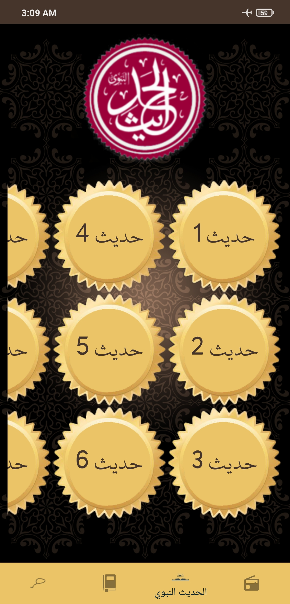
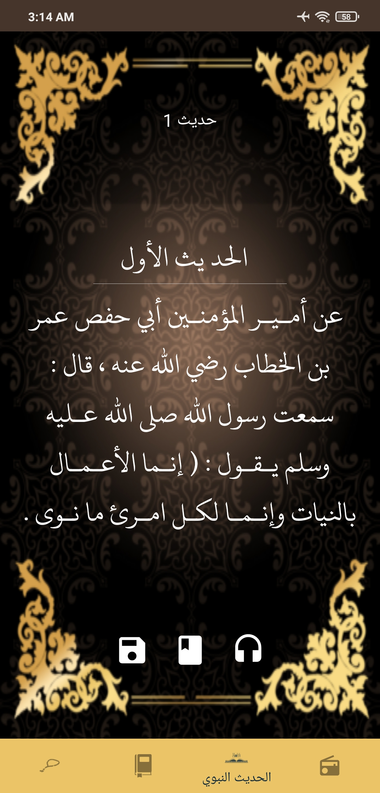
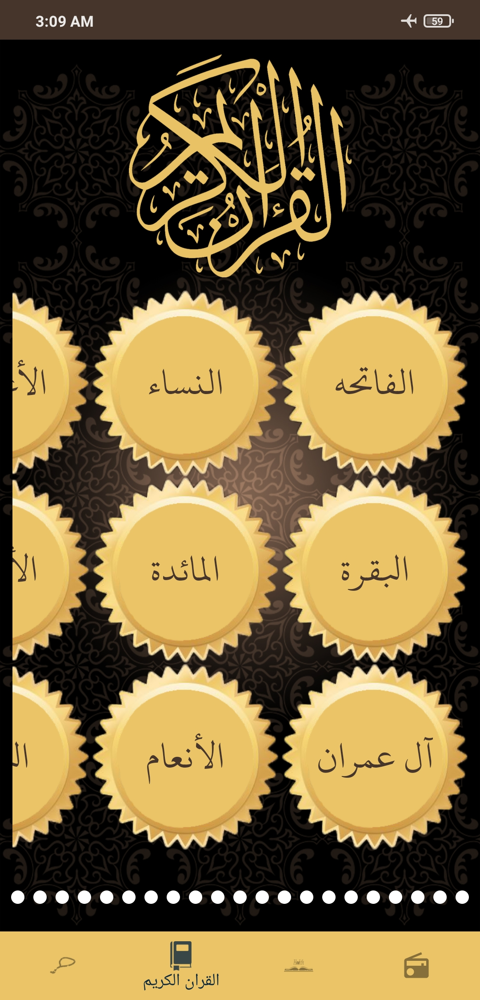
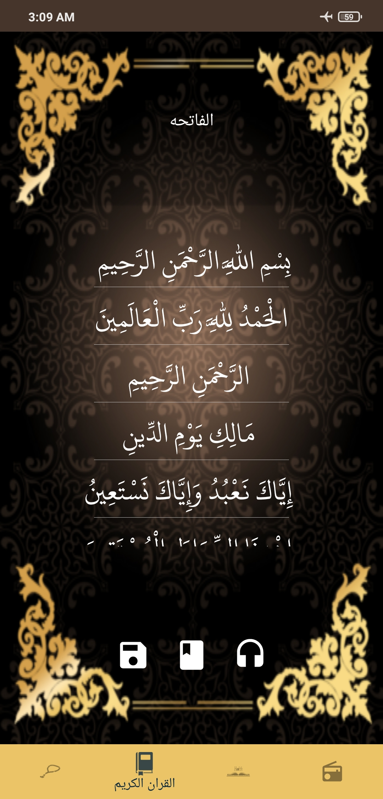

# IslamiApp

Application for Quran, Hadith, Tasbeh, and Quran Radio

You can:

* Yead Holy Quraan

* Read Hadith 

* Count Praise

* Play Quraan radio for more than 50 channels


## Getting Started

download the repo as zip file or you can clone it from link below:

```
https://github.com/Ahmed-P-Mostafa/IslamiApp.git
```

### Prerequisites

The things you'll need in order to use the app and how to install them
* You need to have access to internet
* allow app to work in the background


https://user-images.githubusercontent.com/61784191/124522132-69b18d80-ddf2-11eb-84d8-abfb33cc3ae3.mp4  

https://user-images.githubusercontent.com/61784191/124522224-c90f9d80-ddf2-11eb-87ca-47010386dc25.mp4


### How to use


   

[View all screenshots](docs/all-screenshots.md)


## Built with

* [Kotlin 1.5.10](https://kotlinlang.org/) & [Java 1.8](https://www.java.com/en/) - The programming languages used
* MVC - Design Pattern
* Retrofit
* Navigation Component
* Services
* Buffer reader
